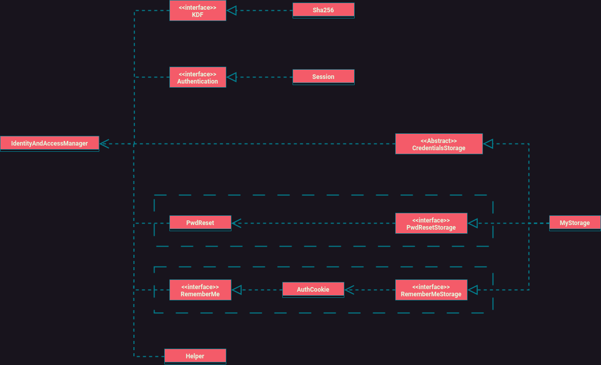

# PHP User Managment

Simple storage detached identity and access managment library written in vanilla PHP.

Currently only session based authentication is supported, but it can be easily be updated to support token based authentication.

## Features

- user register
- user login
- user session managment
- remember me cookies
- password reset over email with [PHPMailer](https://github.com/PHPMailer/PHPMailer/tree/master)

## Usage

1. Copy ./class content to your project
2. Provide implementation of following interfaces:
   - [CredentialsStorage](./IAM-lib/class/class.CredentialsStorage.inc.php)
   - [RememberMeStorage](./IAM-lib/class/class.RememberMeStorage.inc.php)
   - [PwdResetStorage](./IAM-lib/class/class.PwdResetStorage.inc.php) (Optional, only if Password reset option used)
3. Load your constants
4. Instantiate [IdentityAccessManager](./IAM-lib/class/class.IdentityAccessManager.inc.php)
5. Use IdentityAccessManager object

Example of implementation with MySQL can be found inside ./example directory, [here](./examples/mysql/README.md)

## Todo

- [Multiple users accessing with same account ](https://stackoverflow.com/a/9387369)
