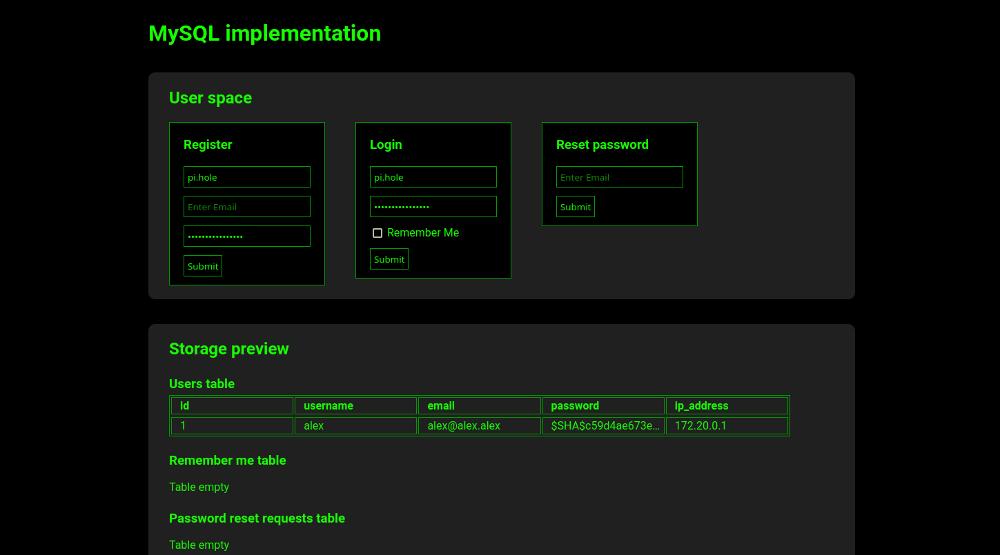

# Minimalistic MySQL implementation

## Requirements

- Docker

## Starting demo

1. Clone the repo `git clone ...`
2. Navigate to `examples/mysql/deployment`
3. Execute `docker compose up -d`
4. (If you want to use password reset feature) Set proper mail server settings inside [constants.inc.php](./src/constants.inc.php)
   1. If you are intending to use **Gmail**:
      1. Enable 2FA
      2. Open [App passwords](https://myaccount.google.com/apppasswords)
      3. Create new
      4. Copy generated app password into *SMTP_PASSWORD* variable
      5. Set e-email address for *SMTP_EMAIL* and *SMTP_USERNAME*
5. Open http://localhost/ inside your browser

When finished, execute `docker compose down`
